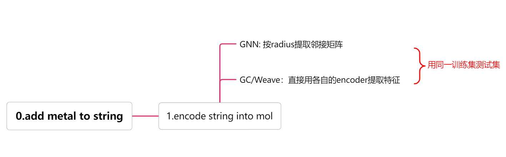

# 论文

Wei Xu, Bo Yang, *Microkinetic modeling with machine learning predicted binding energies of reaction intermediates of ethanol steam reforming: The limitations*, Molecular Catalysis, Volume 537, 2023, 112940, ISSN 2468-8231, [https://doi.org/10.1016/j.mcat.2023.112940](https://doi.org/10.1016/j.mcat.2023.112940).

## 关键特性

1. **结合能预测**: 本项目以结合能作为监督信号，数据集涵盖200多个物种在6种不同单金属催化剂表面的结合能（DFT计算）。

2. **自动特征提取**: 仅使用2D分子图作为输入，模型训练过程中自动提取特征，无需手动构造特征。

3. **独特的分子图设计**: 特别设计的2D分子图将催化剂标签作为图的一部分，并用实线和虚线区分分子图的边，以确保每个分子图的唯一性。

4. **多种神经网络模型**: 考虑了三种不同的神经网络模型（GNN、GC、Weave），以对比模型效果并深入理解它们之间的差异。

5. **全面的模型评估**: 包括交叉验证、网格搜索和多种可视化工具，确保模型的性能和可靠性。

## 代码结构

## 安装
很抱歉本项目暂时未能提供项目所需依赖文件。关键依赖有 Pytorch、RDKit、DeepChem，请自行安装。

## 数据准备
- **0.add_metal_label_to_mol_list.py**: 处理分子字符串，通过添加金属标签（例如 K）来构造新的分子字符串。

## 数据集创建
- **1_make_dataset.py**: 
  - 加载处理后的分子字符串及其能量。
  - 对能量分布进行统计分析。
  - 使用 `OrganicSurfaceSpeciesEncoder` 对分子进行编码。
  - 创建指纹和邻接矩阵表示。
  - 构造ready数据集，保存为 pickle 文件。

## 模型训练
- **2.gnn_global_Random.py**: 
  - 实现用于能量预测的 GNN 模型。
  - 处理超参数配置。
  - 执行训练和评估。
  - 保存嵌入和预测结果。

- **2_train_GNN_do_cross_validation_and_embedding_with_grid_search.py**:
  - 更全面的 GNN 实现，包含交叉验证。
  - 包括超参数优化的网格搜索。
  - 讨论过拟合问题及解决方案（如 dropout 和批归一化）。
  - 保存模型配置和结果。

- **1_train_with_graphConv_grid_search.py** 和 **1_train_with_weave_grid_search.py**:
  - 实现使用 DeepChem 的替代图卷积模型。
  - 对不同架构和超参数进行网格搜索。
  - 保存训练结果和配置。

## 分析与可视化
- **1a_analysis_grid_search_results.py**: 
  - 分析和可视化网格搜索实验的结果。

- **4_visualize_embedding_results.py**:
  - 使用 PCA 可视化分子嵌入。
  - 根据能量或分子组成为点着色。

- **5_visualize_all_species.py**:
  - 使用 RDKit 可视化分子结构。
  - 可以保存分子数组的图像。

## 探索
- **0_understand_featurize.py**:
  - 测试不同分子特征化方法的实验代码。
  - 探索 DeepChem 的 ConvMol 和 Weave 特征提取器。

